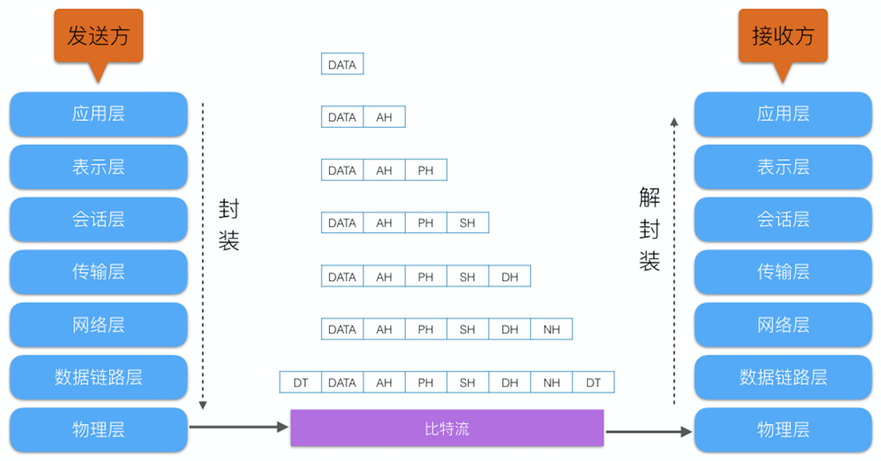
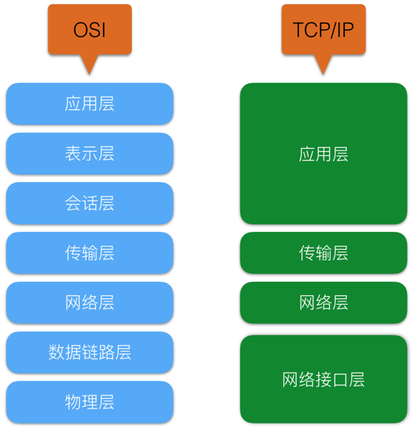
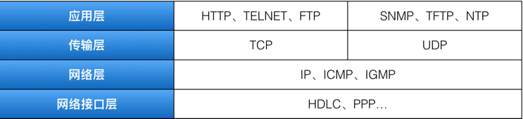
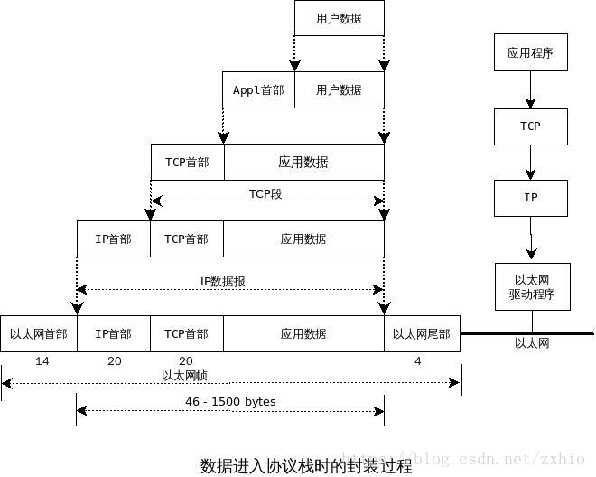
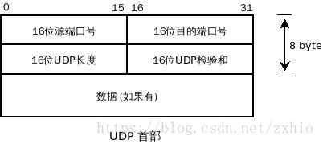
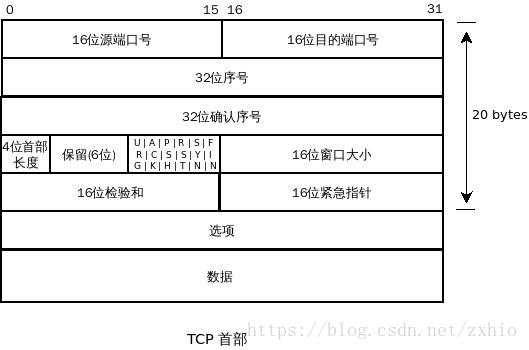
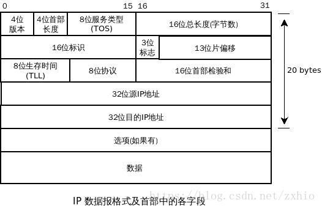
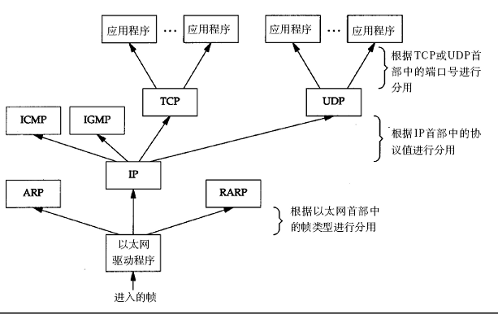
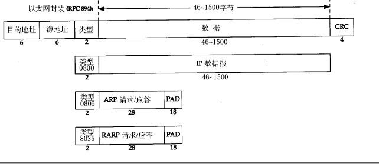
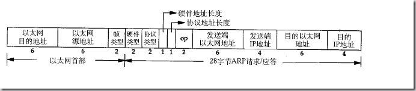

<h2 id="0"></h2>

# Linux 网络编程
[TCP/IP基础篇](#1)

[socket编程篇](#2)

[进程间通信篇](#3)

[线程篇](#4)

[miniftp实战](#5)

 <h2 id="1">一、TCP/IP基础篇</h2>

[ISO/OSI参考模型](#11)

[TCP/IP四层模型](#12)

[基本概念(对等通信、封装、分用、端口)](#13)

[最大传输单元(MTU)/路径MTU](#14)

[以太网帧格式](#15)

[ICMP](#16)

[ARP](#17)

[RARP](#18)

 <h3 id="1.1">ISO/OSI参考模型</h3>

## 1. OSI（open system interconnection），意为开放式系统互联。国际标准化组织（ISO）制定了OSI模型，该模型定义了不同计算机互联的标准，是设计和描述计算机网络通信的基本框架。OSI模型把网络通信的工作分为7层，分别是物理层、数据链路层、网络层、传输层、会话层、表示层和应用层。



## 2. OSI七层模型
|具体七层|数据格式|功能与连接方式|典型设备|协议规范|注|
|----|----|----|----|----|----|
|应用层 Application|数据ATPU|网络服务与使用者应用程序间的一个接口|终端设备（PC、手机、平板等）|HTTP、HTTPS、FTP、TELNET、SSH、SMTP、POP3等|提供应用程序间的通信|
|表示层 Presentation|数据PTPU	|数据表示、数据安全、数据压缩|终端设备（PC、手机、平板等）||处理数据格式、数据加密等|
|会话层 Session|数据DTPU|会话层连接到传输层的映射；会话连接的流量控制；数据传输；会话连接恢复与释放；会话连接管理、差错控制|终端设备（PC、手机、平板等）||建立、维护和管理会话|
|传输层 Transport|数据组织成数据段Segment|用一个寻址机制来标识一个特定的应用程序（端口号）|终端设备（PC、手机、平板等）||建立端到端连接|
|网络层 Network|分割和重新组合数据包Packet|基于网络层地址（IP地址）进行不同网络系统间的路径选择|网关、路由器|IP、IPX、RIP、SOPF、ICMP、IGMP等|寻址和路由选择|
|数据链路层 Data Link|将比特信息封装成数据帧Frame|在物理层上建立、撤销、标识逻辑链接和链路复用 以及差错校验等功能。通过使用接收系统的硬件地址或物理地址来寻址|网桥、交换机|SDLC、HDLC、PPP、STP、帧中继等|介质访问、链路管理|
|物理层Physical|传输比特（bit）流|建立、维护和取消物理连接|光纤、同轴电缆、双绞线、网卡、中继器、集线器|EIA/TIA RS-232、EIA/TIA RS-449、V.35、RJ-45|比特流传输|


 <h3 id="12">TCP/IP四层模型</h3>

## 1. TCP/IP与OSI

- 协议层映射



- 详细协议


- 重要的协议



<h3 id="13">概念</h3>

## 对等通信(peer-to-peer communication)

为了使数据分组从源传送到目的地，源端OSI模型的每一层都必须与目的端的对等层进行通信，这种通信方式称为对等层通信。在这一过程中，每一层的协议在对等层之间交换信息，该信息成为协议数据单元（PDU）。
- 属性：
    网络模型的邻接两层之间
- 同层交互：
    相同层相同协议进行通信，一台计算机上的协议创建报头，如果需要的话还要创建尾部，其目的是和另一台计算机上的相同层相同协议进行通信。
- 邻接层交互：
    较低层的协为较高层的协议服务，仅在一台计算机上，发生在网络模型的邻接两层之间。交互的过程包括封装和解封装时的数据交换，以及较低层的协议如何为较高层的协议提供服务。
- 针对：
    PDU同目的计算机的对等层通信

## 封装(Encapsulation)
thanks for [CSDN 秋风io](https://blog.csdn.net/zxhio/article/details/79952226)



当应用程序用TCP传送数据时,数据被传送入协议栈中,然后逐一通过每一层直到被当作一串比特流送入网络
>注: UDP数据TCP数据基本一致. 唯一不同的是UDP传给IP的信息单元称作UDP数据报

其中每一层对收到的数据都要增加一些首部信息(有时还要增加尾部信息)
>注： 4个字节的32bit值的传输次序：首先是0-7字节，其次是8-15, 然后是16-23, 最后是24-31 bit，这种传输次序称作 big-ending（大端）字节序，或者网络字节序

### UDP封装

- 端口号表示发送进程和接受进程
- UDP长度字段指的是UDP首部和UDP数据的字节长度, 最小为8(发送一份0字节的UDP数据报)
- UDP检验和覆盖UDP首部和UDP数据

### TCP封装


- 每个TCP段都有包含源端和目的端的端口号，用于寻找发端和收端应用进程,这两个端加上IP首部的源端IP地址和目的端IP地址唯一确定一个TCP连接。
- 序号用于标识从TCP发端向TCP收端发送的数据字节流，表示在这个报文段中的第一个数据字节。 如果将字节流看作在两个应用程序间的单向流动，则TCP用序号对每个序号进行计数。
- 确认序号包含发送确认的一端所期望收到的下一个序号，确认序号应当是上次成功收到的数据字节序号加一，只有ACK标志为1时，确认字段序列才有效。
- 首部长度给出首部中32-bit字的数目。这个值存在是由于选项字段的长度是可变的，这个字段占4bit，所以TCP最多有60字节的首部，没有选项字段，正常长度是20字节。
- 6 个标志位 
    - URG ，紧急指针（urgent pointer）有效
    - ACK ，确认序号有效
    - PSH ，接收方法应该尽快将这个报文段交给应用层
    - RST ，重新连接
    - SYN ，同步序号用来发起一个连接
    - FIN ， 发端完成任务
- 窗口大小为字节数，起始于确认序号字段指明的值，这个值是接收端正期望接收的字节，窗口大小为16 bit字段，因而窗口大小为65535个字节。
- 检验和覆盖了整个TCP报文段：TCP首部和TCP数据。
- URG标志置1时紧急指针才有效，紧急指针是一个正的偏移量，和序号字段中的值相加表示紧急数据最后一个字节的序号，TCP的紧急方式是发送端向另一端发送紧急数据的一种方式。
- 最常见的可选字段是最长报文大小，又为 MSS（Maximum Segment Size）。
- TCP 报文段数据部分是可选的

### IP封装

- 协议版本号，IPv4 IPv6
- 首部长度指的是首部占32-bit字的数目，包括任何选项，最长60字节。
- 服务类型字段包括一个3-bit的优先权子字段（现已被忽略），4 bit的TOS子字段和1 bit未用但必须置0，4 bit 的TOS分别代表：最小时延，最大吞吐量，最高可靠性和最小费用，如果所有bit置0，就为一般服务。

|应用程序|最小延时|最大吞吐量|最高可靠性|最小费用|0x|
|----|----|----|----|----|----|
|Telnet/Rlogin|1|0|0|0|0x10|
|FTP(控制，数据，任意数据块)|100|011|000|000|0x10 0x08 0x08|
|TFTP|1|0|0|0|0x10|
|SMTP(命令阶段、数据阶段)|10|01|00|00|0x10 0x08|
|DNS(UDP查询、TCP查询、区域传输)|100|001|000|000|0x10 0x00 0x08|

- 总长度字段是整个IP数据报的长度，以字节为单位。利用首部长度字段和总长度字段就可以知道IP数据报中数据内容的起始位置和长度。总长度也是IP首部中必要的内容，以为一些数据链路需要填充数据以达到最小长度。
- 标识符字段唯一的标识主机发送的每一份数据，通常发一份报文它的值就加1。
- TTL（time-to-live）生存时间字段设置了数据报可以经过的最多路由器数，指定了数据报的生存时间。TTL的初始值由源主机设置（通常为32或者64），一旦经过一个处理它的路由器就减1。当该字段为0时，数据报就被丢弃，并发送ICMP报文通知源主机。
- 首部检验和字段是根据IP首部计算的检验和码，不对首部后面的数据进行计算。ICMP、IGMP、UDP、和TCP在它们各自的首部中均含有同时覆盖首部和数据检验和码。
- 每一份IP数据报都含有源IP地址和目的IP地址
- 选项:<br/>
    选项字段都是以 32-bit作为界限，在必要的时候需要对其进行0填充，保证IP首部始终是32-bit的整数倍（首部长度字段所要求） 
    - 安全和处理限制
    - 记录路径
    - 时间戳
    - 宽松的源站选路
    - 严格的源站选路
<h3 id="133">检验和</h3>


### 检验和算法
- TCP UDP 为了验证还有增加了两个伪首部
- 计算检验和（发送方） 
    - 首先把检验和字段置0
    - 对检验字段（IP只有首部，TCP/UDP等为首部和数据）中每个16-bit进行二进制反码求和
    - 结果存于检验和字段
- 计算检验和（接受方） 
    - 由于接受方在计算过程中包含了发送方存在首部的检验和，因此，如果在传输过程中没有发送任何差错，那么接受方计算的结果应该为全1
- C 的简单实现
```c
unsigned short check_sum(unsigned short *addr,int len)
{
    unsigned long sum;

    for (sum=0; len > 0; len--)
        sum += *addr++;

    sum = (sum >> 16) + (sum & 0xffff);
    sum += (sum >> 16);

    return ~sum;
}
```
## 分用(Demultiplexing)

>数据从下到上进行数据包的解封，又称为数据的分用

- 以太网驱动程序首先根据以太网首部中的“上层协议”字段确定该数据帧的有效载荷（payload，指除去协议首部之外实际传输的数据）是IP、ARP还是RARP协议的数据报，然后交给相应的协议处理。假如是IP数据报，IP协议再根据IP首部中的“上层协议”字段确定该数据报的有效载荷是TCP、UDP、ICMP还是IGMP，然后交给相应的协议处理。假如是TCP段或UDP段，TCP或UDP协议再根据TCP首部或UDP首部的“端口号”字段确定应该将应用层数据交给哪个用户进程。IP地址是标识网络中不同主机的地址，而端口号就是同一台主机上标识不同进程的地址，IP地址和端口号合起来标识网络中唯一的进程。

- 注意，虽然IP、ARP和RARP数据报都需要以太网驱动程序来封装成帧，但是从功能上划分，ARP和RARP属于链路层，IP属于网络层。虽然ICMP、IGMP、TCP、UDP的数据都需要IP协议来封装成数据报，但是从功能上划分，ICMP、IGMP与IP同属于网络层，TCP和UDP属于传输层。

## 端口(port)

- 众所周知的端口：从0到1023，这些端口由IANA分配和控制它们紧密的绑定于一些服务。通常这些端口的通讯表明了某种服务的协议。eg：21端口为ftp服务端口。
- 注册端口(Registered Ports)：从1024到49151。这些端口不受IANA的控制，但是由IANA登记并提供使用情况清单，这些端口同样用于许多其它目的。例如：1433 Microsoft SQL服务端口
- 动态或私有端口(Dynamic or Private Port)：从49152到65535。IANA不管这些端口。实际上，机器从通常从1024起分配动态端口。但也有例外：SUN的RPC端口从32768开始。

 <h3 id="14">最大传输单元(MTU)/路径MTU</h3>

## MTU

 - 以太网和IEEE 802.3对数据帧的长度都有限制，其最大值分别是1500和1492字节，将这个限制称作最大传输单元(MTU，Maximum Transmission Unit)
- 如果IP层有一个数据要传，而且长度比链路层的MTU还大，那么IP层就要进行分片(Fragmentation)，把数据报分成若干片，这样每一片都小于MTU。
- 当网络上的两台主机相互通信时，两台主机之间要经过多个网络，每个网络的链路层可能有不同的MTU，其中两台通信主机路径中的最小MTU被称作路径MTU。

## 以太网帧的格式
thanks for [jeefchen](http://www.uml.org.cn/xjs/201401245.asp?artid=1141)

以太网的帧格式如下所示：


其中的源地址和目的地址是指网卡的硬件地址（也叫MAC地址），长度是48位，是在网卡出厂时固化的。用ifconfig命令看一下，“HWaddr 00:15:F2:14:9E:3F”部分就是硬件地址。类型字段有三种值，分别对应IP、ARP、RARP。帧末尾是CRC校验码。

以太网帧中的数据长度规定最小46字节，最大1500字节，ARP和RARP数据包的长度不够46字节，要在后面补填充位。最大值1500称为以太网的最大传输单元（MTU），不同的网络类型有不同的MTU，如果一个数据包从以太网路由到拨号链路上，数据包长度大于拨号链路的MTU了，则需要对数据包进行分片（fragmentation）。ifconfig命令的输出中也有“MTU:1500”。注意，MTU这个概念指数据帧中有效载荷的最大长度，不包括帧首部的长度。

### 用于以太网的ARP数据报格式

IP地址 $\rightarrow$ MAC地址

在网络通讯时，源主机的应用程序知道目的主机的IP地址和端口号，却不知道目的主机的硬件地址，而数据包首先是被网卡接收到再去处理上层协议的，如果接收到的数据包的硬件地址与本机不符，则直接丢弃。因此在通讯前必须获得目的主机的硬件地址。ARP协议就起到这个作用。

源主机发出ARP请求，询问“IP地址是192.168.0.1的主机的硬件地址是多少”，并将这个请求广播到本地网段（以太网帧首部的硬件地址填FF:FF:FF:FF:FF:FF表示广播），目的主机接收到广播的ARP请求，发现其中的IP地址与本机相符，则发送一个ARP应答数据包给源主机，将自己的硬件地址填写在应答包中。

每台主机都维护一个ARP缓存表，可以用arp -a命令查看。缓存表中的表项有过期时间（一般为20分钟），如果20分钟内没有再次使用某个表项，则该表项失效，下次还要发ARP请求来获得目的主机的硬件地址。想一想，为什么表项要有过期时间而不是一直有效？

ARP数据报的格式如下所示:


注意到源MAC地址、目的MAC地址在以太网首部和ARP请求中各出现一次，对于链路层为以太网的情况是多余的，但如果链路层是其它类型的网络则有可能是必要的。硬件类型指链路层网络类型，1为以太网，协议类型指要转换的地址类型，0x0800为IP地址，后面两个地址长度对于以太网地址和IP地址分别为6和4（字节），op字段为1表示ARP请求，op字段为2表示ARP应答。

实例：
请求帧如下（为了清晰在每行的前面加了字节计数，每行16个字节）：

    以太网首部（14字节） 
    0000: ff ff ff ff ff ff 00 05 5d 61 58 a8 08 06 
    ARP帧（28字节） 
    0000:                                           00 01 
    0010: 08 00 06 04 00 01 00 05 5d 61 58 a8 c0 a8 00 37 
    0020: 00 00 00 00 00 00 c0 a8 00 02 
    填充位（18字节） 
    0020:                               00 77 31 d2 50 10 
    0030: fd 78 41 d3 00 00 00 00 00 00 00 00

以太网首部：目的主机采用广播地址，源主机的MAC地址是00:05:5d:61:58:a8，上层协议类型0x0806表示ARP。

ARP帧：硬件类型0x0001表示以太网，协议类型0x0800表示IP协议，硬件地址（MAC地址）长度为6，协议地址（IP地址）长度为4，op为0x0001表示请求目的主机的MAC地址，源主机MAC地址为00:05:5d:61:58:a8，源主机IP地址为c0 a8 00 37（192.168.0.55），目的主机MAC地址全0待填写，目的主机IP地址为c0 a8 00 02（192.168.0.2）。

由于以太网规定最小数据长度为46字节，ARP帧长度只有28字节，因此有18字节填充位，填充位的内容没有定义，与具体实现相关。

应答帧如下：

    以太网首部 
    0000: 00 05 5d 61 58 a8 00 05 5d a1 b8 40 08 06 
    ARP帧 
    0000:                                           00 01 
    0010: 08 00 06 04 00 02 00 05 5d a1 b8 40 c0 a8 00 02 
    0020: 00 05 5d 61 58 a8 c0 a8 00 37 
    填充位 
    0020:                               00 77 31 d2 50 10 
    0030: fd 78 41 d3 00 00 00 00 00 00 00 00

以太网首部：目的主机的MAC地址是00:05:5d:61:58:a8，源主机的MAC地址是00:05:5d:a1:b8:40，上层协议类型0x0806表示ARP。

ARP帧：硬件类型0x0001表示以太网，协议类型0x0800表示IP协议，硬件地址（MAC地址）长度为6，协议地址（IP地址）长度为4，op为0x0002表示应答，源主机MAC地址为00:05:5d:a1:b8:40，源主机IP地址为c0 a8 00 02（192.168.0.2），目的主机MAC地址为00:05:5d:61:58:a8，目的主机IP地址为c0 a8 00 37（192.168.0.55）。

## ICMP
ICMP协议用于传递差错信息、时间、回显、网络信息等控制数据
