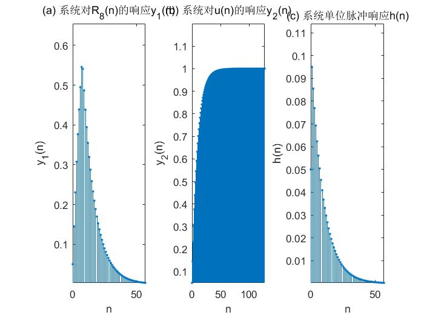
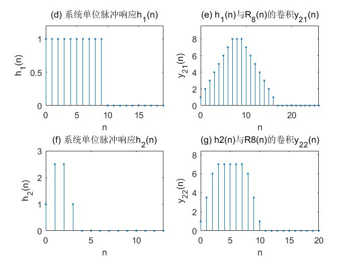
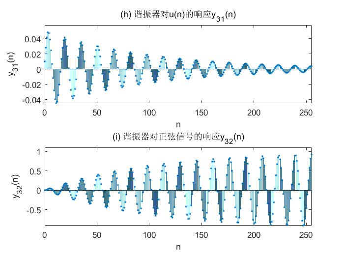

# 实验一:  系统响应及系统稳定性
## 1. 实验目的
- （1）掌握	求系统响应的方法。
- （2）掌握时域离散系统的时域特性。
- （3）分析、观察及检验系统的稳定性。

## 2. 实验原理与方法

&emsp;&emsp;在时域中，描写系统特性的方法是差分方程和单位脉冲响应，在频域可以用系统函数描述系统特性。已知输入信号可以由差分方程、单位脉冲响应或系统函数求出系统对于该输入信号的响应，本实验仅在时域求解。在计算机上适合用递推法求差分方程的解，最简单的方法是采用MATLAB语言的工具箱函数filter函数。也可以用MATLAB语言的工具箱函数conv函数计算输入信号和系统的单位脉冲响应的线性卷积，求出系统的响应。

&emsp;&emsp;系统的时域特性指的是系统的线性时不变性质、因果性和稳定性。重点分析实验系统的稳定性，包括观察系统的暂态响应和稳定响应。

&emsp;&emsp;系统的稳定性是指对任意有界的输入信号，系统都能得到有界的系统响应。或者系统的单位脉冲响应满足绝对可和的条件。系统的稳定性由其差分方程的系数决定。

&emsp;&emsp;实际中检查系统是否稳定，不可能检查系统对所有有界的输入信号，输出是否都是有界输出，或者检查系统的单位脉冲响应满足绝对可和的条件。可行的方法是在系统的输入端加入单位阶跃序列，如果系统的输出趋近一个常数（包括零），就可以断定系统是稳定的[19]。系统的稳态输出是指当时，系统的输出。如果系统稳定，信号加入系统后，系统输出的开始一段称为暂态效应，随n的加大，幅度趋于稳定，达到稳态输出。

&emsp;&emsp;注意在以下实验中均假设系统的初始状态为零。

## 3. 实验内容及步骤

- （1）编制程序，包括产生输入信号、单位脉冲响应序列的子程序，用filter函数或conv函数求解系统输出响应的主程序。程序中要有绘制信号波形的功能。
- （2）给定一个低通滤波器的差分方程为
$$
y(n)=0.05x(n)+0.05x(n-1)+0.9y(n-1)
$$

    输入信号:

$$\begin{eqnarray}
		x_1(n)&=&R_8(n)\\
		x_2(n)&=&u(n)
	\end{eqnarray}
$$

    - a) 分别求出系统对$x_1(n)=R_8(n)$和$x_2(n)=u(n)$的响应序列，并画出其波形。
    
    - b) 求出系统的单位冲响应，画出其波形。
  
- （3）给定系统的单位脉冲响应为:
$$\begin{eqnarray}
		h_1(n)&=&R_10(n)\\
		h_2(n)&=&\delta(n)+2.5\delta(n-1)+2.5\delta(n-2)+\delta(n-3)
	\end{eqnarray}
$$
&emsp;&emsp;用线性卷积法分别求系统$h_1(n)$和$h_2(n)$对$x_2(n)=u(n)$的输出响应，并画出波形。
- （4）给定一谐振器的差分方程为
$$
y(n)=1.8237y(n-1)-0.9801y(n-2)+b_0(n)-b_0x(n-2)
$$
    令$b_0=1/100.49$，谐振器的谐振频率为$0.4rad$。
    
    - a) 用实验方法检查系统是否稳定。输入信号为时，画出系统输出波形。
    - b) 给定输入信号为
$$
x(n)=sin(0.014n)+sin(0.4n)
$$

&emsp;&emsp;求出系统的输出响应，并画出其波形。


## 4. 思考题

- (1) 如果输入信号为无限长序列，系统的单位脉冲响应是有限长序列，可否用线性卷积法求系统的响应? 如何求？
- (2) 如果信号经过低通滤波器，把信号的高频分量滤掉，时域信号会有何变化，用前面第一个实验结果进行分析说明。

答：

- (1) 如果输入信号为无限长序列，系统的单位脉冲响应是有限长序列，可否用线性卷积法求系统的响应。①对输入信号序列分段；②求单位脉冲响应h(n)与各段的卷积；③将各段卷积结果相加。具体实现方法有第三章介绍的重叠相加法和重叠保留法。
- (2) 如果信号经过低通滤波器，把信号的高频分量滤掉，时域信号的剧烈变化将被平滑，由实验内容（1）结果图10.1.1(a)、(b)和(c)可见，经过系统低通滤波使输入信号和的阶跃变化变得缓慢上升与下降。

## 5. 实验代码
```matlab
close all;clear all;
%调用fliter解差分方程，由系统对un的响应判断稳定??

%内容1??调用filter解差分方程，  由系统对u(n)的响应判断稳定??
A=[1,-0.9];B=[0.05,0.05];
x1n=[1 1 1 1 1 1 1 1 zeros(1,50)];
x2n=ones(1,128);
y1n=filter(B,A,x1n);
subplot(1,3,1);y='y1(n)';tstem(y1n,y);
ylabel('y_1(n)','Interpreter','tex');
title({'(a) 系统对R_8(n)的响应y_1(n)'},'Interpreter','tex');
y2n=filter(B,A,x2n);
subplot(1,3,2);y='y2(n)';tstem(y2n, y);
ylabel('y_2(n)','Interpreter','tex');
title('(b) 系统对u(n)的响应y_2(n)','Interpreter','tex');
hn=impz(B,A,58);
subplot(1,3,3);y='h(n)';tstem(hn,y);
ylabel('h(n)','Interpreter','tex');
title('(c) 系统单位脉冲响应h(n)','Interpreter','tex');

%内容2??调用conv函数计算卷积
x1n=[1 1 1 1 1 1 1 1]; %产生信号x1n=R8n
h1n=[ones(1,10) zeros(1,10)];
h2n=[1 2.5 2.5 1 zeros(1,10)];
y21n=conv(h1n,x1n);
y22n=conv(h2n,x1n);
figure(2)
subplot(2,2,1);y='h1(n)';tstem(h1n,y);
ylabel('h_1(n)','Interpreter','tex');    
title('(d) 系统单位脉冲响应h_1(n)','Interpreter','tex');

subplot(2,2,2);y='y21(n)';tstem(y21n,y);
ylabel('y_2_1(n)','Interpreter','tex');
title('(e) h_1(n)与R_8(n)的卷积y_2_1(n)','Interpreter','tex');
subplot(2, 2,3); y='h2(n)';tstem(h2n,y);     %调用函数tstem绘图
ylabel('h_2(n)','Interpreter','tex');
title('(f) 系统单位脉冲响应h_2(n)','Interpreter','tex');
subplot(2, 2, 4); y='y22(n)';tstem(y22n, y);
ylabel('y_2_2(n)','Interpreter','tex');
title('(g) h2(n)与R8(n)的卷积y_2_2(n)','Interpreter','tex');

%内容3??谐振器分??
un=ones(1, 256);    %产生信号un
n=0:255;
xsin=sin(0.014*n)+sin(0.4*n);  %产生正弦信号
A=[1,-1.8237,0.9801];
B=[1/100.49,0,-1/100.49]; 
%系统差分方程系数向量B和A
y31n=filter(B,A,un);   %谐振器对un的响应y31n
y32n=filter(B,A,xsin);
%谐振器对正弦信号的响应y32n
figure(3)
subplot(2,1,1);y='y31(n)';tstem(y31n,y);
ylabel('y_3_1(n)','Interpreter','tex');
title('(h) 谐振器对u(n)的响应y_3_1(n)','Interpreter','tex');
subplot(2,1,2);y='y32(n)';tstem(y32n,y);
ylabel('y_3_2(n)','Interpreter','tex');
title('(i) 谐振器对正弦信号的响应y_3_2(n)','Interpreter','tex');


function tstem(xn,yn)
n = 0:length(xn)-1;
stem(n,xn,'.');
xlabel('n','Interpreter','tex');
axis([0,n(end),min(xn),1.2*max(xn)]);
end
```

## 6.实验截图



