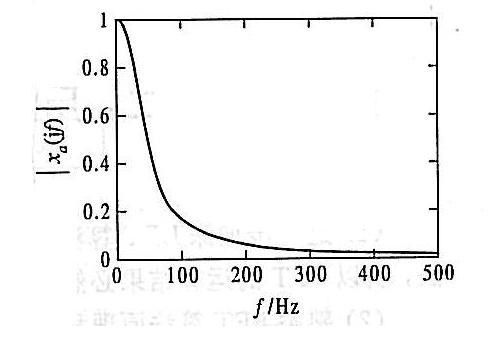
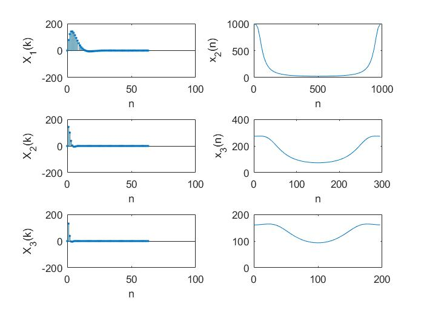
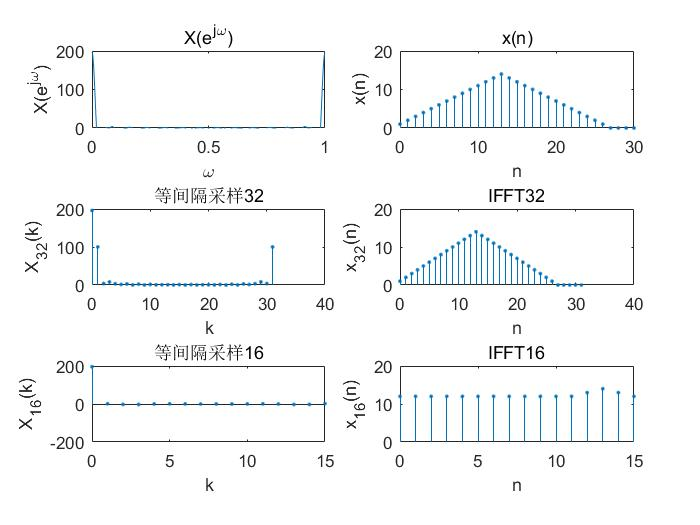

# 实验二：时域采样与频域采样
## 1.实验目的
&emsp;&emsp;时域采样理论与频域采样理论是数字信号处理中的重要理论。要求掌握模拟信号采样前后频谱的变化，以及如何选择采样频率才能使采样后的信号不丢失信息；要求掌握频率域采样会引起时域周期化的概念，以及频率域采样定理及其对频域采样点数选择的指导作用。
## 2.实验原理与方法
- 时域采样定理的要点是：
    - a)对模拟信号$x_a()$以间隔T进行时域等间隔理想采样，形成的采样信号的频谱$\hat{X}(j\Omega)$是原模拟信号频谱$X_a(j\Omega)$以采样角频率$\Omega_s（\Omega_s=2\pi /T）$为周期进行周期延拓。公式为：
$$
\hat{X}_a(j\Omega)=FT[\hat{x}_a(t)]=\frac{1}{T}\sum^{\infty}_{n=-\infty}X_a(j\Omega-jn\Omega)
$$
    - b)采样频率必须大于等于模拟信号最高频率的两倍以上，才能使采样信号的频谱不产生频谱混叠。

&emsp;&emsp;利用计算机计算上式并不方便，下面我们导出另外一个公式，以便用计算机上进行实验。
&emsp;&emsp;理想采样信号和模拟信号之间的关系为：
$$
\hat{x}_a=x_a(t)\sum^{\infty}_{n=-\infty}\delta(t-nT)
$$
对上式进行傅立叶变换，得到：
$$\begin{eqnarray}\hat{X}_a(j\Omega)
&=&\int^{\infty}_{-\infty}[x_a(t)\sum^{\infty}_{n=-\infty}\delta(t-nT)]e^{-j\Omega t}dt\\
&=&\sum^{\infty}_{n=-\infty}\int^{\infty}_{-\infty}x_a(t)\delta(t-nT)e^{-j\Omega t}dt
\end{eqnarray}
$$
在上式的积分号内只有当$t=nT$时，才有非零值，因此：
$$
\hat{X}_a(j\Omega)=\sum^{\infty}_{n=-\infty}x_a(nT)e^{-j\Omega nT}
$$
上式中，在数值上$x_a(nT)＝x(n)$，再将$\omega=\Omega T$代入，得到：
$$
\hat{X}_a(j\Omega)=\sum^{\infty}_{n=-\infty}x_a(n)e^{-j\omega n}
$$
上式的右边就是序列的傅立叶变换，即：
$$
\hat{X}_a(j\Omega)=X(e^{j\omega})\bracevert _{\omega=\Omega T}
$$
上式说明理想采样信号的傅立叶变换可用相应的采样序列的傅立叶变换得到，只要将自变量ω用代替即可。
- 频域采样定理的要点是：
    - a)对信号$x(n)$的频谱函数$X(e^{j\omega})$在$[0,2\pi]$上等间隔采样$N$点，得到
$$
X_N(k)=X(e^{j\omega})|_{\omega=\frac{2\pi k}{N}}，k=0,1,2,…,N-1
$$
则N点$IDFT[X_N(k)]$得到的序列就是原序列x(n)以N为周期进行周期延拓后的主值区序列，公式为：
$$
x_N(n)=IDFT[X_N(k)]_N=[\sum^{\infty}_{i=-\infty}x(n+iN)]R_N(n)
$$
    - b)由上式可知，频域采样点数N必须大于等于时域离散信号的长度M(即N≥M)，才能使时域不产生混叠，则N点$IDFT[X_N(k)]$得到的序列$[X_N(n)]$就是原序列$x_N(n),即=x(n)$。如果N>M，$x_N(n)$l比原序列尾部多N-M个零点；如果N<M，z则$x_N(n)=IDFT[X_N(k)]$发生了时域混叠失真，而且$x_N(n)$的长度N也比x(n)的长度M短，因此。$x_N(n)$与$x(n)$不相同。

&emsp;&emsp;在数字信号处理的应用中，只要涉及时域或者频域采样，都必须服从这两个采样理论的要点。

&emsp;&emsp;对比上面叙述的时域采样原理和频域采样原理，得到一个有用的结论，这两个采样理论具有对偶性：“时域采样频谱周期延拓，频域采样时域信号周期延拓”。因此放在一起进行实验。

## 3.实验内容及步骤
- （1）时域采样理论的验证。
给定模拟信号,$x_a(t)=Ae^{-\alpha t}sin(\Omega_0t)u(t)$

式中$A=444.128，\alpha =50\pi，\Omega_0 =50\sqrt{2}\pi rad/s$，它的幅频特性曲线如下图：

&emsp;&emsp;现用DFT(FFT)求该模拟信号的幅频特性，以验证时域采样理论。
&emsp;&emsp;按照$x_a(t)$的幅频特性曲线，选取三种采样频率，即$F_s=1kHz，300Hz，200Hz$。观测时间选$T_p=50ms$。
&emsp;&emsp;为使用DFT，首先用下面公式产生时域离散信号，对三种采样频率，采样序列按顺序用$x_1(n),x_2(n),x_3(n)$表示。
$$
x(n)=x_a(nT)=Ae^{\alpha n T}sin(\Omega_0nT)u(nT)
$$
&emsp;&emsp;因为采样频率不同，得到的$x_1(n),x_2(n),x_3(n)$的长度不同，长度（点数）用公式$N=T_p\times F_s$计算。选FFT的变换点数为M=64，序列长度不够64的尾部加零。
$X(k)=FFT[x(n)] ，  k=0,1,2,3,…M-1$
式中k代表的频率为$\omega_k=\frac{2\pi}{M}k$。

&emsp;&emsp;编写实验程序，计算$x_1(n),x_2(n)和x_3(n)$的幅度特性，并绘图显示。观察分析频谱混叠失真。
- (2)频域采样理论的验证
给定信号如下：
$$
x(n)=
\left\{\begin{array} 
		n+1, & 0\le n \le13\\ 
		27-n, & 14\le n \le26\\
      0 ,  & else
	\end{array}\right.
$$

&emsp;&emsp;编写程序分别对频谱函数$X(e^{j\omega})=FT[x(n)]$在区间$[0,2\pi]$上等间隔采样32和16点，得到$X_{32}(k)$和$X_{16}(k)$：
$$
X_{32}(k)=X(e^{j\omega})|_{\omega=\frac{2\pi}{32}k},k=0,1,2,3,…,31
$$
$$
X_{16}(k)=X(e^{j\omega})|_{\omega=\frac{2\pi}{16}k},k=0,1,2,3,…,15
$$

&emsp;&emsp;再分别对$X_{32}(k)$和$X_{16}(k)$进行32点和16点IFFT，得到$x_{32}(n)$和$x_{16}(n)$：
$$
x_{32}(n)=IFFT[X_{32}(k)]_{32},n=0,1,2,3,…,31
$$
$$
x_{16}(n)=IFFT[X_{16}(k)]_{16},n=0,1,2,3,…,15
$$

&emsp;&emsp;分别画出$X(e^{j\omega})$、$X_{32}(k)$和$X_{16}(k)$的幅度谱，并绘图显示x(n)、的波形，进行对比和分析，验证总结频域采样理论。

提示：频域采样用以下方法容易变程序实现。
- ① 直接调用MATLAB函数fft计算$X_{32}$就得到$X(e^{j\omega})$在$[0,2\pi]$的32点频率域采样
- ② 抽取$X_{32}$的偶数点即可得到$X(e^{j\omega})$在$[0,2\pi]$的16点频率域采样$X_{16}(k)，即,$X_{16}(k)=X_{32}(2k),k=0,1,2,3,…,15$
- ③当然也可以按照频域采样理论，先将信号$x(n)$以16为周期进行周期延拓，取其主值区（16点），再对其进行16点DFT(FFT),得到的就是$X(e^{j\omega})$在$[0,2\pi]的16点频率域采样$X_{16}(k)$。

## 4．思考题：

&emsp;&emsp;如果序列x(n)的长度为M，希望得到其频谱$X(e^{j\omega})$在$[0,2\pi]$上的N点等间隔采样，当N<M时， 如何用一次最少点数的DFT得到该频谱采样？

&emsp;&emsp;答：先对原序列x(n)以N为周期进行周期延拓后取主值区序列:
$$
x_N(n)=[\sum^{\infty}_{i=-\infty}x(n+iN)]R_N(n)
$$
再计算N点DFT则得到N点频域采样:
$$
X_N(k)=DFT[x_N(n)]_N=X(e^{j\omega})|_{\omega=\frac{2\pi}{N}k},k=0,1,2,3,…,N-1
$$

## 5. 实验代码

第一题
```matlab

Fs=[1000;300;200];
Tp=[64/1000;64/300;64/200];
a=444.128;
b=50*sqrt(2)*pi;
w=50*sqrt(2)*pi;
n=0:63;
xL=['n','n','n'];
yL=['x_1(n)';'x_2(n)';'x_3(n)'];
yL2=['X_1(k)';'X_2(k)';'X_3(k)'];
for i = 1 : 3
    t=1/Fs(i,1);
    x=a*exp(-1*b*t*n).*sin(w*t*n).*(t*n>0);
    y=fft(x,64);
    m=abs(y);
    f=(0:63)/Tp(i,1);
    xlabel(xL(i));ylabel({yL(i,:)},'Interpreter','tex');subplot(3,2,2*i-1);stem(n,x,'.'); 
    xlabel(xL(i));ylabel({yL2(i,:)},'Interpreter','tex');subplot(3,2,2*i); plot(f,m);
   
end

```
第二题
```matlab

n=0:30;
x=(n>=0&n<=13).*(n+1)+(n>13&n<27).*(27-n)+(n>=27)*0;
subplot(3,2,2);
stem(n,x,'.');xlabel('n');ylabel('x(n)');title('x(n)');
y=fft(x,1024);
m=abs(y);
f=(0:length(m)-1)/1024;
subplot(3,2,1);
plot(f,y);
axis([0,1,0,200]);xlabel('\omega');ylabel('X(e^{j\omega})');title('X(e^{j\omega})');

y1=fft(x,32);
y2=ifft(y1);
f1=0:31;
subplot(3,2,3);
stem(f1,abs(y1),'.');xlabel('k');ylabel('X_3_2(k)');title('等间隔采样32');

subplot(3,2,4);
stem(f1,y2,'.');xlabel('n');ylabel('x_3_2(n)');title('IFFT32');


y3=y1(1:2:32);
y4=ifft(y3,16);
f2=0:15;
subplot(3,2,5);
stem(f2,y3,'.');xlabel('k');ylabel('X_1_6(k)');title('等间隔采样16');

subplot(3,2,6);
stem(f2,y4,'.');xlabel('n');ylabel('x_1_6(n)');title('IFFT16');
```

## 6. 实验截图





