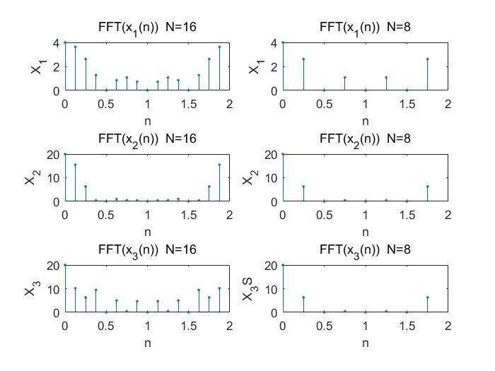
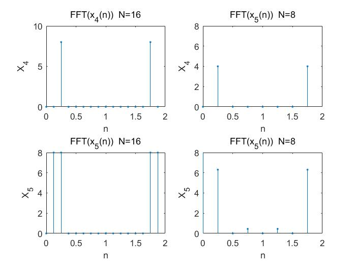
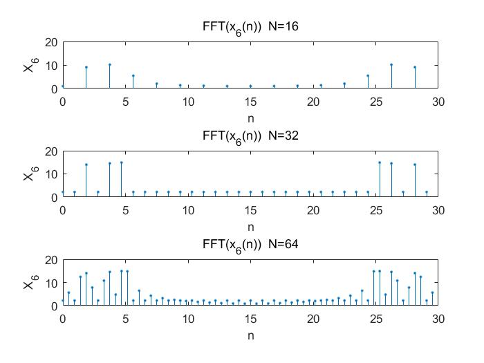

# 实验三：用FFT对信号作频谱分析
## 1. 实验目的
&emsp;&emsp;学习用FFT对连续信号和时域离散信号进行谱分析的方法，了解可能出现的分析误差及其原因，以便正确应用FFT。
## 2.实验原理
&emsp;&emsp;用FFT对信号作频谱分析是学习数字信号处理的重要内容。经常需要进行谱分析的信号是模拟信号和时域离散信号。对信号进行谱分析的重要问题是频谱分辨率D和分析误差。频谱分辨率直接和FFT的变换区间N有关，因为FFT能够实现的频率分辨率是$2\pi /N$，因此要求$2\pi /N\le D$。可以根据此式选择FFT的变换区间N。误差主要来自于用FFT作频谱分析时，得到的是离散谱，而信号（周期信号除外）是连续谱，只有当N较大时离散谱的包络才能逼近于连续谱，因此N要适当选择大一些。
&emsp;&emsp;周期信号的频谱是离散谱，只有用整数倍周期的长度作FFT，得到的离散谱才能代表周期信号的频谱。如果不知道信号周期，可以尽量选择信号的观察时间长一些。
&emsp;&emsp;对模拟信号进行谱分析时，首先要按照采样定理将其变成时域离散信号。如果是模拟周期信号，也应该选取整数倍周期的长度，经过采样后形成周期序列，按照周期序列的谱分析进行。


## 3.实验步骤及内容
- （1）对以下序列进行谱分析。
$$
x_1(n)=R_4(n)
$$
$$
x_2(n)=
\left\{\begin{array} 
		n+1, & 0\le n \le3\\ 
		8-n, & 4\le n \le7\\
      0 ,  & else
	\end{array}\right.
$$
$$
x_3(n)=
\left\{\begin{array} 
		4-n, & 0\le n \le3\\ 
		n-3, & 4\le n \le7\\
      0 ,  & else
	\end{array}\right.
$$
&emsp;&emsp;选择FFT的变换区间N为8和16 两种情况进行频谱分析。分别打印其幅频特性曲线。 并进行对比、分析和讨论。
- （2）对以下周期序列进行谱分析。
$$
$$\begin{eqnarray}
		x_4(n)&=&cos\frac{\pi}{4}n\\
		x_5(n)&=&cos(\pi n/4)+cos(\pi n/8)
	\end{eqnarray}$$
$$
&emsp;&emsp;选择FFT的变换区间N为8和16 两种情况分别对以上序列进行频谱分析。分别打印其幅频特性曲线。并进行对比、分析和讨论。
- （3）对模拟周期信号进行谱分析
$$
x_6(t)=cos8\pi t+cos16\pi t+cos20\pi t\\
$$
&emsp;&emsp;选择采样频率$F_s=64Hz$，变换区间$N=16,32,64$ 三种情况进行谱分析。分别打印其幅频特性，并进行分析和讨论。

## 4.思考题
- （1）对于周期序列，如果周期不知道，如何用FFT进行谱分析？
- （2）如何选择FFT的变换区间？（包括非周期信号和周期信号）
- （3）当N=8时，$x_2(n)$和$x_3(n)$的幅频特性会相同吗？为什么？N=16 呢？

答：

- （1）周期信号的周期预先不知道时,可先截取M点进行DFT,再将截取长度扩大1倍截取,比
- （2）
    - 一、对于非周期信号：有频谱分辨率F，而频谱分辨率直接和FFT的变换区间有关，因为FFT能够实现的频率分辨率是2π/N...因此有最小的N>2π/F。就可以根据此式选择FFT的变换区间。
    - 二、对于周期信号，周期信号的频谱是离散谱，只有用整数倍周期的长度作FFT，得到的离散谱才能代表周期信号的频谱。
- （3）N=8时两个的幅频特性相同，因为其不为0的区间长度正好是8。N=16时两个的幅频特性不相同。
    - $x_4(n)=cos\frac{\pi}{4}n$的周期为8，所以N=8和N=16均是其周期的整数倍，得到正确的单一频率正弦波的频谱，仅在$0.25\pi$处有1根单一谱线。
    - $x_5=cos(\pi n/4)+cos(\pi n/8)$的周期为16，所以N=8不是其周期的整数倍，得到的频谱不正确.。N=16是其一个周期，得到正确的频谱，仅在$0.25\pi$和$0.125\pi$处有2根单一谱线,


## 5.实验源代码
### 第一题
```matlab
x=[ones(1,4)];
n=0:30;
x1=(n>=0&n<=3).*(n+1)+(n>3&n<=7).*(8-n)+(n>7)*0;
x2=(n>=0&n<=3).*(4-n)+(n>3&n<=7).*(n-3)+(n>7)*0;
y1=fft(x,16);
y2=fft(x,8);
f1=(0:15)/8;
f2=(0:7)/4;
subplot(3,2,1);
stem(f1,abs(y1),'.');xlabel('n');ylabel('X_1');title('FFT(x_1(n))  N=16');
subplot(3,2,2);
stem(f2,abs(y2),'.');xlabel('n');ylabel('X_1');title('FFT(x_1(n))  N=8');

y11=fft(x1,16);
y12=fft(x1,8);
subplot(3,2,3);
stem(f1,abs(y11),'.');xlabel('n');ylabel('X_2');title('FFT(x_2(n))  N=16');
subplot(3,2,4);
stem(f2,abs(y12),'.');xlabel('n');ylabel('X_2');title('FFT(x_2(n))  N=8');

y21=fft(x2,16);
y22=fft(x2,8);
subplot(3,2,5);
stem(f1,abs(y21),'.');xlabel('n');ylabel('X_3');title('FFT(x_3(n))  N=16');
subplot(3,2,6);
stem(f2,abs(y22),'.');xlabel('n');ylabel('X_3S');title('FFT(x_3(n))  N=8');


```
## 第二题
```matlab
n=0:40;
x=cos(pi/4*n);
x1=cos(pi/4*n)+cos(pi/8*n);
y1=fft(x,16);
y2=fft(x,8);
f1=(0:15)/8;
f2=(0:7)/4;
subplot(2,2,1);
stem(f1,abs(y1),'.');xlabel('n');ylabel('X_4');title('FFT(x_4(n))  N=16');
subplot(2,2,2);
stem(f2,abs(y2),'.');xlabel('n');ylabel('X_4');title('FFT(x_5(n))  N=8');
axis([0,2,0,8]);

y11=fft(x1,16);
y12=fft(x2,8);
subplot(2,2,3);
stem(f1,abs(y11),'.');xlabel('n');ylabel('X_5');title('FFT(x_5(n))  N=16');
subplot(2,2,4);
stem(f2,abs(y12),'.');xlabel('n');ylabel('X_5');title('FFT(x_5(n))  N=8');
axis([0,2,0,8])


```
## 第三题
```matlab
t=1/64;
n=0:30;
x=cos(pi*8*n*t)+cos(pi*16*n*t)+cos(pi*20*n*t);
y1=fft(x,16);
y2=fft(x,32);
y3=fft(x,64);
f1=(0:15)/16*30;
f2=(0:31)/32*30;
f3=(0:63)/64*30;
subplot(3,1,1);
stem(f1,abs(y1),'.');xlabel('n');ylabel('X_6');title('FFT(x_6(n))  N=16');
subplot(3,1,2);
stem(f2,abs(y2),'.');xlabel('n');ylabel('X_6');title('FFT(x_6(n))  N=32');
subplot(3,1,3);
stem(f3,abs(y3),'.');xlabel('n');ylabel('X_6');title('FFT(x_6(n))  N=64');
```

## 6. 实验截图



