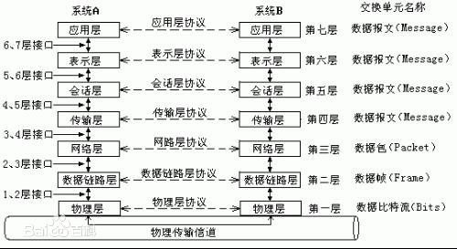
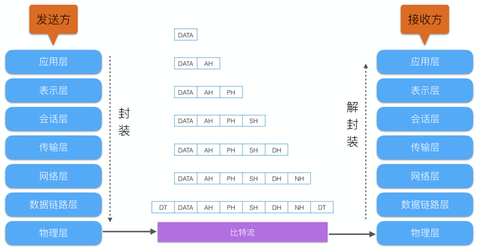
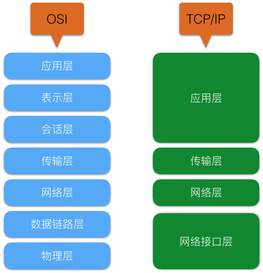
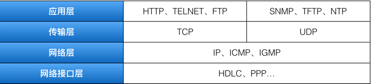
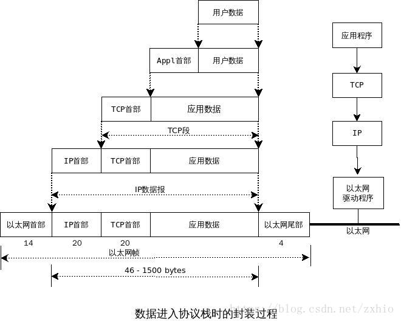
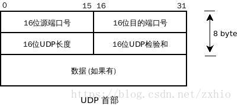
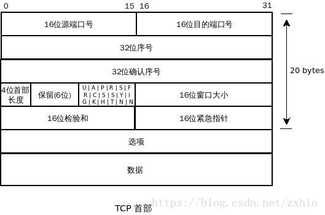
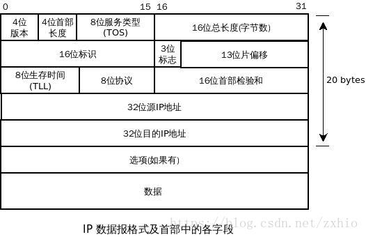

<h2 id="0"></h2>

# Linux 网络编程
[TCP/IP基础篇](#1)

[socket编程篇](#2)

[进程间通信篇](#3)

[线程篇](#4)

[miniftp实战](#5)

 <h2 id="1">一、TCP/IP基础篇</h2>

[ISO/OSI参考模型](#11)

[TCP/IP四层模型](#12)

[基本概念(对等通信、封装、分用、端口)](#13)

 <h3 id="1.1">ISO/OSI参考模型</h3>

## 1. OSI（open system interconnection），意为开放式系统互联。国际标准化组织（ISO）制定了OSI模型，该模型定义了不同计算机互联的标准，是设计和描述计算机网络通信的基本框架。OSI模型把网络通信的工作分为7层，分别是物理层、数据链路层、网络层、传输层、会话层、表示层和应用层。

## 2. OSI七层模型
|具体七层|数据格式|功能与连接方式|典型设备|协议规范|注|
|----|----|----|----|----|----|
|应用层 Application|数据ATPU|网络服务与使用者应用程序间的一个接口|终端设备（PC、手机、平板等）|HTTP、HTTPS、FTP、TELNET、SSH、SMTP、POP3等|提供应用程序间的通信|
|表示层 Presentation|数据PTPU	|数据表示、数据安全、数据压缩|终端设备（PC、手机、平板等）||处理数据格式、数据加密等|
|会话层 Session|数据DTPU|会话层连接到传输层的映射；会话连接的流量控制；数据传输；会话连接恢复与释放；会话连接管理、差错控制|终端设备（PC、手机、平板等）||建立、维护和管理会话|
|传输层 Transport|数据组织成数据段Segment|用一个寻址机制来标识一个特定的应用程序（端口号）|终端设备（PC、手机、平板等）||建立端到端连接|
|网络层 Network|分割和重新组合数据包Packet|基于网络层地址（IP地址）进行不同网络系统间的路径选择|网关、路由器|IP、IPX、RIP、SOPF、ICMP、IGMP等|寻址和路由选择|
|数据链路层 Data Link|将比特信息封装成数据帧Frame|在物理层上建立、撤销、标识逻辑链接和链路复用 以及差错校验等功能。通过使用接收系统的硬件地址或物理地址来寻址|网桥、交换机|SDLC、HDLC、PPP、STP、帧中继等|介质访问、链路管理|
|物理层Physical|传输比特（bit）流|建立、维护和取消物理连接|光纤、同轴电缆、双绞线、网卡、中继器、集线器|EIA/TIA RS-232、EIA/TIA RS-449、V.35、RJ-45|比特流传输|

 <h3 id="12">TCP/IP四层模型</h3>

## 1. TCP/IP与OSI

- 协议层映射

- 详细协议

- 重要的协议

<h3 id="13">概念</h3>

## 对等通信(peer-to-peer communication)

为了使数据分组从源传送到目的地，源端OSI模型的每一层都必须与目的端的对等层进行通信，这种通信方式称为对等层通信。在这一过程中，每一层的协议在对等层之间交换信息，该信息成为协议数据单元（PDU）。
- 属性：
    网络模型的邻接两层之间
- 同层交互：
    相同层相同协议进行通信，一台计算机上的协议创建报头，如果需要的话还要创建尾部，其目的是和另一台计算机上的相同层相同协议进行通信。
- 邻接层交互：
    较低层的协为较高层的协议服务，仅在一台计算机上，发生在网络模型的邻接两层之间。交互的过程包括封装和解封装时的数据交换，以及较低层的协议如何为较高层的协议提供服务。
- 针对：
    PDU同目的计算机的对等层通信

## 封装(Encapsulation)
thanks for [CSDN 秋风io](https://blog.csdn.net/zxhio/article/details/79952226)

当应用程序用TCP传送数据时,数据被传送入协议栈中,然后逐一通过每一层直到被当作一串比特流送入网络
>注: UDP数据TCP数据基本一致. 唯一不同的是UDP传给IP的信息单元称作UDP数据报

其中每一层对收到的数据都要增加一些首部信息(有时还要增加尾部信息)
>注： 4个字节的32bit值的传输次序：首先是0-7字节，其次是8-15, 然后是16-23, 最后是24-31 bit，这种传输次序称作 big-ending（大端）字节序，或者网络字节序

### UDP封装

- 端口号表示发送进程和接受进程
- UDP长度字段指的是UDP首部和UDP数据的字节长度, 最小为8(发送一份0字节的UDP数据报)
- UDP检验和覆盖UDP首部和UDP数据

### TCP封装

- 每个TCP段都有包含源端和目的端的端口号，用于寻找发端和收端应用进程,这两个端加上IP首部的源端IP地址和目的端IP地址唯一确定一个TCP连接。
- 序号用于标识从TCP发端向TCP收端发送的数据字节流，表示在这个报文段中的第一个数据字节。 如果将字节流看作在两个应用程序间的单向流动，则TCP用序号对每个序号进行计数。
- 确认序号包含发送确认的一端所期望收到的下一个序号，确认序号应当是上次成功收到的数据字节序号加一，只有ACK标志为1时，确认字段序列才有效。
- 首部长度给出首部中32-bit字的数目。这个值存在是由于选项字段的长度是可变的，这个字段占4bit，所以TCP最多有60字节的首部，没有选项字段，正常长度是20字节。
- 6 个标志位 
    - URG ，紧急指针（urgent pointer）有效
    - ACK ，确认序号有效
    - PSH ，接收方法应该尽快将这个报文段交给应用层
    - RST ，重新连接
    - SYN ，同步序号用来发起一个连接
    - FIN ， 发端完成任务
- 窗口大小为字节数，起始于确认序号字段指明的值，这个值是接收端正期望接收的字节，窗口大小为16 bit字段，因而窗口大小为65535个字节。
- 检验和覆盖了整个TCP报文段：TCP首部和TCP数据。
- URG标志置1时紧急指针才有效，紧急指针是一个正的偏移量，和序号字段中的值相加表示紧急数据最后一个字节的序号，TCP的紧急方式是发送端向另一端发送紧急数据的一种方式。
- 最常见的可选字段是最长报文大小，又为 MSS（Maximum Segment Size）。
- TCP 报文段数据部分是可选的

### IP封装

- 协议版本号，IPv4 IPv6
- 首部长度指的是首部占32-bit字的数目，包括任何选项，最长60字节。
- 服务类型字段包括一个3-bit的优先权子字段（现已被忽略），4 bit的TOS子字段和1 bit未用但必须置0，4 bit 的TOS分别代表：最小时延，最大吞吐量，最高可靠性和最小费用，如果所有bit置0，就为一般服务。

|应用程序|最小延时|最大吞吐量|最高可靠性|最小费用|0x|
|----|----|----|----|----|----|
|Telnet/Rlogin|1|0|0|0|0x10|
|FTP(控制，数据，任意数据块)|100|011|000|000|0x10 0x08 0x08|
|TFTP|1|0|0|0|0x10|
|SMTP(命令阶段、数据阶段)|10|01|00|00|0x10 0x08|
|DNS(UDP查询、TCP查询、区域传输)|100|001|000|000|0x10 0x00 0x08|

- 总长度字段是整个IP数据报的长度，以字节为单位。利用首部长度字段和总长度字段就可以知道IP数据报中数据内容的起始位置和长度。总长度也是IP首部中必要的内容，以为一些数据链路需要填充数据以达到最小长度。
- 标识符字段唯一的标识主机发送的每一份数据，通常发一份报文它的值就加1。
- TTL（time-to-live）生存时间字段设置了数据报可以经过的最多路由器数，指定了数据报的生存时间。TTL的初始值由源主机设置（通常为32或者64），一旦经过一个处理它的路由器就减1。当该字段为0时，数据报就被丢弃，并发送ICMP报文通知源主机。
- 首部检验和字段是根据IP首部计算的检验和码，不对首部后面的数据进行计算。ICMP、IGMP、UDP、和TCP在它们各自的首部中均含有同时覆盖首部和数据检验和码。
- 每一份IP数据报都含有源IP地址和目的IP地址
- 选项: 
    选项字段都是以 32-bit作为界限，在必要的时候需要对其进行0填充，保证IP首部始终是32-bit的整数倍（首部长度字段所要求） 
    - 安全和处理限制
    - 记录路径
    - 时间戳
    - 宽松的源站选路
    - 严格的源站选路
<h3 id="133">检验和</h3>

 
### 检验和算法